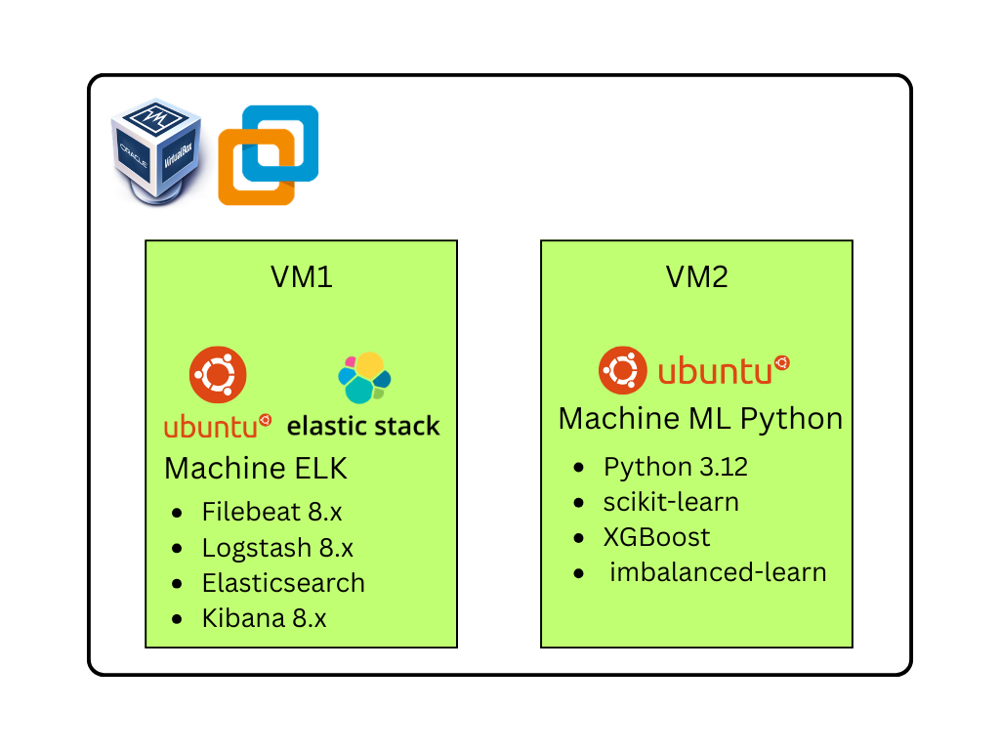

---
# TP - Mise en place d'un pipeline de détection d'intrusions avec ELK et Machine Learning

**Version :** 1.0 &nbsp;&nbsp;&nbsp;&nbsp; **Création :** 06/2026 &nbsp;&nbsp;&nbsp;&nbsp; **Module :** FYC

**Auteur :** Savita, Swane &nbsp;&nbsp;&nbsp;&nbsp; **Durée :** 4 heures &nbsp;&nbsp;&nbsp;&nbsp; **Niveau :** M2

---


## Sommaire

1. [Introduction](#1-introduction)
   1. [Contexte](#11-contexte)
   2. [TP Maquette](#12-tp-maquette)
   3. [Données disponibles](#13-données-disponibles)
2. [Partie 1 — Stack ELK](#2-partie-1--stack-elk----20-pts) *(20 pts)*
   1. [Vérification des services](#21-vérification-des-services)
   2. [Configuration Filebeat](#22-configuration-filebeat)
   3. [Pipeline Logstash — Parsing Grok](#23-pipeline-logstash--parsing-grok)
   4. [Dashboard Kibana](#24-dashboard-kibana)
   5. [Requêtes DSL Elasticsearch](#25-requêtes-dsl-elasticsearch)
3. [Partie 2 — Elastic ML](#3-partie-2--elastic-ml----15-pts) *(15 pts)*
   1. [Job de détection d'anomalies](#31-job-de-détection-danomalies)
   2. [Anomaly Explorer](#32-anomaly-explorer)
   3. [Seuils et limites](#33-seuils-et-limites)
4. [Partie 3 — Pipeline Python supervisé](#4-partie-3--pipeline-python-supervisé----30-pts) *(30 pts)*
   1. [Exploration du dataset](#41-exploration-du-dataset)
   2. [Feature Engineering](#42-feature-engineering)
   3. [Prétraitement et SMOTE](#43-prétraitement-et-smote)
   4. [Entraînement et comparaison des modèles](#44-entraînement-et-comparaison-des-modèles)
   5. [Optimisation GridSearchCV](#45-optimisation-gridsearchcv)
   6. [Prédiction en temps réel](#46-prédiction-en-temps-réel)
5. [Partie 4 — Cas pratique intégré](#5-partie-4--cas-pratique-intégré----15-pts) *(15 pts)*
   1. [Simulation d'attaque en temps réel](#51-simulation-dattaque-en-temps-réel)
   2. [Analyse complète de l'IP suspecte](#52-analyse-complète-de-lip-suspecte)
   3. [Complémentarité ELK ML vs Python ML](#53-complémentarité-elk-ml-vs-python-ml)
6. [Mémos](#6-mémos)
   1. [Commandes Linux utiles](#61-commandes-linux-utiles)
   2. [Elasticsearch — Requêtes DSL](#62-elasticsearch--requêtes-dsl)
   3. [Python — rappels scikit-learn](#63-python--rappels-scikit-learn)
   4. [Kibana — Navigation rapide](#64-kibana--navigation-rapide)

---

## 1. Introduction

### 1.1. Contexte

Dans ce TP, vous allez construire une **chaîne complète de détection d'intrusions SSH**, en combinant trois approches complémentaires :

- La **stack ELK** pour la collecte, le parsing et la visualisation des logs
- **Elastic ML** pour la détection d'anomalies non supervisée
- Un **pipeline Python** avec Machine Learning supervisé pour la classification des événements

L'objectif final est d'être capable de détecter automatiquement des comportements suspects dans des journaux de connexion SSH, en comprenant les forces et limites de chaque approche.

> Aucune correction ne sera fournie. Vous devez justifier chacun de vos choix techniques dans votre rapport.

### 1.2. TP Maquette



> Les deux machines peuvent être des VMs, des machines physiques ou des conteneurs selon votre environnement de travail. Voir [IMPORT_VMS.md](IMPORT_VMS.md)

### 1.3. Données disponibles

**Sur la machine ELK :**
- `/var/log/auth.log` — 50 000 logs SSH simulés (format syslog standard)
- Index Elasticsearch `ssh-logs-*` — 50 000 documents indexés

**Sur la machine ML :**
- `/home/adminml/ssh_dataset.csv` — 50 000 événements étiquetés
- `/home/adminml/auth_realistic.log` — logs bruts correspondants
- Environnement Python virtuel : `/home/adminml/fyc-ml/`

**Distribution du dataset :**

| Catégorie | Volume | Pourcentage |
|---|---|---|
| Connexions normales (IP interne, heures bureau) | 42 500 | 85% |
| Échecs légitimes (IP interne ou externe connue) | 4 000 | 8% |
| Attaques brute-force (IP externe, nuit) | 2 500 | 5% |
| Attaques lentes (IP externe, heures bureau) | 1 000 | 2% |

**IPs de référence :**

```
IPs internes légitimes  : 192.168.1.50 — 192.168.1.75 — 10.0.0.25 — 192.168.1.100
IPs externes légitimes  : 82.64.12.33 — 90.112.45.67
IPs attaquantes connues : 185.220.101.45 — 42.96.145.33 — 165.232.189.42
                          103.45.67.89  — 159.89.166.45 — 45.142.212.61
```

---

## 2. Partie 1 — Stack ELK *(20 pts)*

### 2.1. Vérification des services *(3 pts)*

Connectez-vous sur la machine ELK.

Vérifiez que les quatre services de la stack ELK sont actifs :

```bash
sudo systemctl status elasticsearch kibana logstash filebeat --no-pager | grep Active
```

**Q1.1** — Relevez pour chacun des quatre services : son statut, sa date de démarrage, et son port d'écoute.

**Q1.2** — Vérifiez que les 50 000 documents sont bien indexés dans Elasticsearch :

```bash
curl -s http://localhost:9200/ssh-logs-*/_count
```

Quel résultat obtenez-vous ? Que signifie le champ `count` dans la réponse JSON ?

---

### 2.2. Configuration Filebeat *(3 pts)*

**Q1.3** — Affichez la configuration complète de Filebeat :

```bash
sudo cat /etc/filebeat/filebeat.yml
```

Expliquez le rôle de chaque section : `filebeat.inputs`, `paths`, `fields`, `output.logstash`.

**Q1.4** — Pourquoi Filebeat envoie-t-il les logs vers Logstash plutôt que directement vers Elasticsearch ?  
Quelle étape de traitement serait perdue sans Logstash dans la chaîne ?

---

### 2.3. Pipeline Logstash — Parsing Grok *(5 pts)*

**Q1.5** — Affichez le fichier de configuration du pipeline Logstash :

```bash
sudo cat /etc/logstash/conf.d/ssh-pipeline.conf
```

Le pipeline comporte trois blocs : `input`, `filter`, `output`. Expliquez le rôle de chacun dans la chaîne de traitement.

**Q1.6** — Le bloc `filter` contient un filtre Grok. Expliquez ce qu'il fait sur la ligne de log suivante :

```
Jan 15 03:22:17 server sshd[12453]: Failed password for root from 185.220.101.45 port 52341 ssh2
```

Listez **tous les champs extraits** et leur valeur pour cette ligne précise.

**Q1.7** — Le filtre Ruby ajoute le champ `is_internal_ip`.  
Quelle sera sa valeur pour `185.220.101.45` ? Pour `192.168.1.50` ?  
Expliquez la logique de détection utilisée.

---

### 2.4. Dashboard Kibana *(5 pts)*

Ouvrez Kibana dans votre navigateur et accédez au dashboard SSH.

**Q1.8** — Le dashboard contient plusieurs visualisations. Pour **chacune** d'entre elles, expliquez :
- Ce qu'elle représente
- Pourquoi elle est utile pour un analyste SOC

**Q1.9** — Les IPs internes (192.168.x.x) dominent le classement des top IPs sources. Est-ce anormal ? Justifiez votre réponse en vous appuyant sur la distribution du dataset.

**Q1.10** — Le pie chart des méthodes d'authentification affiche environ **60% `publickey`** et **40% `password`**.  
Que pouvez-vous conclure sur la posture de sécurité de l'infrastructure ?

> **Conseil** : Utilisez le filtre de temps de Kibana pour isoler une plage horaire précise. Cela peut aider à observer des tendances.

---

### 2.5. Requêtes DSL Elasticsearch *(4 pts)*

Accédez à **Kibana → Dev Tools** pour exécuter les requêtes suivantes.

**Q1.11** — Écrivez et exécutez une requête DSL pour afficher les **10 usernames les plus ciblés** par l'IP `45.142.212.61`.

Votre requête doit utiliser la structure suivante :

```json
GET ssh-logs-*/_search
{
  "size": 0,
  "query": { ... },
  "aggs": { ... }
}
```

Copiez la requête complète **et** le résultat JSON dans votre rapport.

**Q1.12** — Écrivez une requête DSL pour afficher la **timeline des tentatives `Failed`** agrégées par heure, pour l'ensemble des IPs attaquantes connues.

Copiez la requête et le résultat dans votre rapport.

---

> ###  Synthèse 1
> Résumez en 4 à 6 lignes ce que vous avez mis en place dans cette partie.  
> **Appelez votre chargé de TP pour valider votre dashboard Kibana.**

---

## 3. Partie 2 — Elastic ML *(15 pts)*

### 3.1. Job de détection d'anomalies *(5 pts)*

Accédez à **Kibana → Machine Learning → Anomaly Detection → Jobs**.

**Q2.1** — Relevez la configuration complète du job de détection existant :

| Paramètre | Valeur |
|---|---|
| Nom du job | |
| Type de job | |
| Champ de découpage (split field) | |
| Influenceurs | |
| Bucket span | |

**Q2.2** — Pourquoi avoir choisi un **bucket span de 5 minutes** ?  
Qu'est-ce qui se passerait avec un bucket d'**1 minute** ? D'**1 heure** ?

**Q2.3** — Pourquoi utiliser un job **Multi-metric** plutôt que **Single metric** dans ce contexte ?  
Quelle différence cela introduit-il pour la qualité de la détection ?

---

### 3.2. Anomaly Explorer *(5 pts)*

Accédez à **ML → Anomaly Explorer** et sélectionnez le job de détection.

**Q2.4** — Lisez l'Anomaly Timeline. Quelle IP source présente le **score d'anomalie le plus élevé** ? Quel est ce score ?

**Q2.5** — Une anomalie de type **"Unexpected zero value"** est détectée sur des IPs internes.  
Expliquez ce phénomène. S'agit-il d'une vraie attaque ? Justifiez votre réponse.

**Q2.6** — Définissez la différence entre :

- Une anomalie **temporelle** *(par rapport à l'historique d'une entité)*
- Une anomalie **comportementale** *(par rapport aux autres entités de la population)*

Donnez un exemple concret de chaque dans le contexte de l'analyse SSH.

---

### 3.3. Seuils et limites *(5 pts)*

**Q2.7** — Définissez et justifiez les seuils d'action que vous préconisez pour le score d'anomalie :

| Plage de score | Action recommandée | Justification |
|---|---|---|
| … à … | Investigation manuelle | |
| … à … | Alerte automatique | |
| … à 100 | Blocage automatique | |

Expliquez le **risque** associé à un seuil trop bas et à un seuil trop élevé.

**Q2.8** — Identifiez **3 limites** du machine learning non supervisé pour la détection d'intrusions SSH.  
Pour chacune, proposez une solution complémentaire.

---

> ###  Synthèse 2
> Résumez en 4 à 6 lignes les anomalies identifiées par Elastic ML et les limites observées.  
> **Appelez votre chargé de TP pour valider votre analyse.**

---

## 4. Partie 3 — Pipeline Python supervisé *(30 pts)*

Connectez-vous sur la machine ML et activez l'environnement Python :

```bash
source /home/adminml/fyc-ml/bin/activate
```

### 4.1. Exploration du dataset *(5 pts)*

**Q3.1** — Chargez le fichier `ssh_dataset.csv` et affichez dans un shell Python interactif :

```python
import pandas as pd
df = pd.read_csv('/home/adminml/ssh_dataset.csv')
print(df.head())
print(df.describe())
print(df['label'].value_counts())
print(f"Taux d'attaque : {df['label'].mean()*100:.1f}%")
```

Relevez et commentez chaque résultat dans votre rapport.

**Q3.2** — Pourquoi ce dataset est-il considéré comme **déséquilibré** ?  
Quel problème cela pose-t-il pour l'entraînement d'un modèle de classification ?

---

### 4.2. Feature Engineering *(5 pts)*

**Q3.3** — Créez les variables suivantes et justifiez le choix de chacune :

| Variable | Description | Justification attendue |
|---|---|---|
| `hour` | Heure extraite du timestamp | |
| `is_night` | 1 si heure entre 0h et 6h | |
| `is_failed` | 1 si résultat = `Failed` | |
| `is_internal` | 1 si IP interne (RFC 1918) | |
| `is_password_auth` | 1 si méthode = `password` | |
| `username_enc` | Encodage numérique du username | |
| `src_ip_enc` | Encodage numérique de l'IP source | |

**Q3.4** — Pourquoi est-il nécessaire d'**encoder** les variables textuelles comme `username` et `src_ip` avant d'entraîner un modèle ?

---

### 4.3. Prétraitement et SMOTE *(5 pts)*

**Q3.5** — Séparez le dataset en ensemble d'entraînement (70%) et de test (30%) avec stratification :

```python
from sklearn.model_selection import train_test_split
X_train, X_test, y_train, y_test = train_test_split(
    X, y, test_size=0.30, random_state=42, stratify=y
)
```

Justifiez l'utilisation du paramètre `stratify`.

**Q3.6** — Appliquez SMOTE sur l'ensemble d'entraînement :

```python
from imblearn.over_sampling import SMOTE
smote = SMOTE(random_state=42)
X_train_bal, y_train_bal = smote.fit_resample(X_train, y_train)
```

Expliquez le **principe de SMOTE**. Quelle est la distribution des classes avant et après application ?

**Q3.7** — Normalisez les données avec `StandardScaler`. Pourquoi est-il important d'appliquer le scaler **uniquement sur les données d'entraînement** et de le réutiliser ensuite sur les données de test ?

---

### 4.4. Entraînement et comparaison des modèles *(8 pts)*

**Q3.8** — Entraînez les trois modèles suivants et exécutez le script `ml_pipeline.py` :

```bash
python3 /home/adminml/ml_pipeline.py
```

Relevez pour chaque modèle : le **temps d'entraînement** et l'**AUC-ROC**.

| Modèle | Temps (s) | AUC-ROC |
|---|---|---|
| Régression Logistique | | |
| Random Forest | | |
| XGBoost | | |

**Q3.9** — Pour chaque modèle, affichez le rapport de classification complet.  
Quel modèle est le meilleur selon l'**AUC-ROC** ? Selon le **F1-score** ?

**Q3.10** — En cybersécurité, quelle métrique est la plus critique entre le **rappel** et la **précision** pour la détection d'attaques ? Justifiez votre réponse avec un exemple concret.

**Q3.11** — Incluez dans votre rapport la **courbe ROC** générée par le script.  
Que représente l'aire sous la courbe (AUC) ?

---

### 4.5. Optimisation GridSearchCV *(5 pts)*

Exécutez le script d'optimisation :

```bash
python3 /home/adminml/optimize_rf.py
```

Ce script teste la grille de paramètres suivante sur Random Forest :

```python
param_grid = {
    'n_estimators':      [50, 100, 200],
    'max_depth':         [10, 20, None],
    'min_samples_split': [2, 5, 10]
}
```

**Q3.12** — Relevez les **meilleurs paramètres** trouvés et le **meilleur F1-score** en validation croisée.

**Q3.13** — Comparez le F1-score du Random Forest **optimisé** avec celui du modèle **par défaut**.  
La différence est-elle significative ? Qu'en concluez-vous sur l'intérêt de l'optimisation ?

---

### 4.6. Prédiction en temps réel *(2 pts)*

**Q3.14** — Construisez et prédisez un événement fictif présentant les caractéristiques suivantes :

```python
new_event = pd.DataFrame([{
    'hour': 3,            # 3h du matin
    'is_night': 1,
    'is_failed': 1,       # échec
    'is_internal': 0,     # IP externe
    'is_password_auth': 1,
    'src_port': 52341,
    'username_enc': 0,    # root
    'src_ip_enc': 0
}])
```

Affichez la **probabilité d'attaque** retournée par votre meilleur modèle.  
Quelle décision prenez-vous (bloquer / alerter / accepter) ? Justifiez le seuil choisi.

---

> ###  Synthèse 3
> Résumez en 4 à 6 lignes les résultats de votre pipeline ML et le modèle retenu.  
> **Appelez votre chargé de TP pour lui montrer vos courbes ROC et votre tableau comparatif.**

---

## 5. Partie 4 — Cas pratique intégré *(15 pts)*

### 5.1. Simulation d'attaque en temps réel *(5 pts)*

**Q4.1** — Dans Kibana, retrouvez toutes les connexions associées à l'IP `45.142.212.61`.  
Relevez : **combien** de connexions, à **quelles heures**, sur **quels usernames**.

**Q4.2** — Sur la machine ML, construisez un ensemble d'événements correspondant au profil d'attaque de cette IP et exécutez votre modèle.  
Relevez les **probabilités d'attaque** obtenues pour chaque événement.

**Q4.3** — L'IP `45.142.212.61` est-elle détectée comme suspecte par **Elastic ML** ?  
Quel est son score d'anomalie ?

---

### 5.2. Analyse complète de l'IP suspecte *(5 pts)*

**Q4.4** — En combinant les résultats ELK, Elastic ML et votre modèle Python, rédigez un **rapport d'analyse** de l'IP `45.142.212.61` répondant aux points suivants :

- Période d'activité observée
- Comptes ciblés
- Volume total de tentatives
- Probabilité d'attaque attribuée par le modèle Python
- Score d'anomalie Elastic ML
- **Action recommandée** et justification

---

### 5.3. Complémentarité ELK ML vs Python ML *(5 pts)*

**Q4.5** — Complétez le tableau comparatif suivant :

| Critère | Elastic ML | Python ML supervisé |
|---|---|---|
| Type d'apprentissage | | |
| Données d'étiquetage requises | | |
| Détection d'attaques inconnues | | |
| Classification d'attaques connues | | |
| Facilité de mise à jour | | |
| Interprétabilité | | |

**Q4.6** — Dans une architecture SOC réelle, comment utiliseriez-vous ces deux approches de manière **complémentaire** ?  
Décrivez un scénario concret où les deux sont nécessaires.

**Q4.7** — Citez **deux limites** de l'approche supervisée Python dans un contexte réel de production.  
Proposez une solution concrète pour chacune.

---

> ###  Synthèse finale
> Résumez en 5 à 8 lignes l'intérêt de combiner ELK, Elastic ML et un pipeline Python supervisé dans un contexte SOC.  
> **Appelez votre chargé de TP pour la validation finale.**

---

## Livrables attendus

À la fin du TP, rendez :

- Un **rapport** contenant vos réponses à toutes les questions, avec captures d'écran
- Les **scripts Python** utilisés ou modifiés
- Les **graphiques générés** (courbes ROC, importance des features)
- Les **requêtes DSL** avec leur résultat JSON
- Une **conclusion personnelle** sur l'intérêt de l'approche combinée

---

## Barème

| Partie | Points |
|---|---|
| Partie 1 — Stack ELK | 20 pts |
| Partie 2 — Elastic ML | 15 pts |
| Partie 3 — Pipeline Python | 30 pts |
| Partie 4 — Cas pratique intégré | 15 pts |
| **Total** | **80 pts** |

> *La qualité de la rédaction et la rigueur des justifications techniques seront valorisées dans chaque partie.*

---

## 6. Mémos

### 6.1. Commandes Linux utiles

Vérifier l'état d'un service :
```bash
sudo systemctl status <service>
```

Afficher les logs d'un service en temps réel :
```bash
sudo journalctl -u <service> -f
```

Tester la connectivité vers Elasticsearch :
```bash
curl -s http://localhost:9200
curl -s http://localhost:9200/_cat/indices?v
```

Activer un environnement Python virtuel :
```bash
source /home/adminml/fyc-ml/bin/activate
```

---

### 6.2. Elasticsearch — Requêtes DSL

Compter les documents d'un index :
```json
GET ssh-logs-*/_count
```

Rechercher des documents avec filtre :
```json
GET ssh-logs-*/_search
{
  "query": {
    "term": { "src_ip": "45.142.212.61" }
  }
}
```

Agrégation par champ (top valeurs) :
```json
GET ssh-logs-*/_search
{
  "size": 0,
  "aggs": {
    "top_users": {
      "terms": { "field": "username.keyword", "size": 10 }
    }
  }
}
```

Agrégation temporelle par heure :
```json
"aggs": {
  "par_heure": {
    "date_histogram": {
      "field": "@timestamp",
      "calendar_interval": "hour"
    }
  }
}
```

---

### 6.3. Python — rappels scikit-learn

Métriques de classification :
```python
from sklearn.metrics import classification_report, roc_auc_score
print(classification_report(y_test, y_pred, target_names=['Normal', 'Attaque']))
auc = roc_auc_score(y_test, y_proba)
```

Courbe ROC :
```python
from sklearn.metrics import roc_curve
import matplotlib.pyplot as plt

fpr, tpr, _ = roc_curve(y_test, y_proba)
plt.plot(fpr, tpr, label=f'AUC = {auc:.3f}')
plt.plot([0,1],[0,1],'k--')
plt.xlabel('Faux Positifs')
plt.ylabel('Vrais Positifs')
plt.legend()
plt.savefig('roc.png')
```

SMOTE :
```python
from imblearn.over_sampling import SMOTE
smote = SMOTE(random_state=42)
X_bal, y_bal = smote.fit_resample(X_train, y_train)
```

GridSearchCV :
```python
from sklearn.model_selection import GridSearchCV
gs = GridSearchCV(model, param_grid, cv=3, scoring='f1', n_jobs=-1)
gs.fit(X_train, y_train)
print(gs.best_params_)
```

---

### 6.4. Kibana — Navigation rapide

| Fonctionnalité | Chemin |
|---|---|
| Explorer les logs | Discover |
| Créer une visualisation | Visualize Library → Create |
| Créer un dashboard | Dashboard → Create |
| Accéder à Elastic ML | Machine Learning → Anomaly Detection |
| Dev Tools (requêtes DSL) | Management → Dev Tools |
| Rafraîchir les index | Management → Index Patterns → Refresh |

---

*FYC — Cybersécurité 5ème année — 2025/2026*
